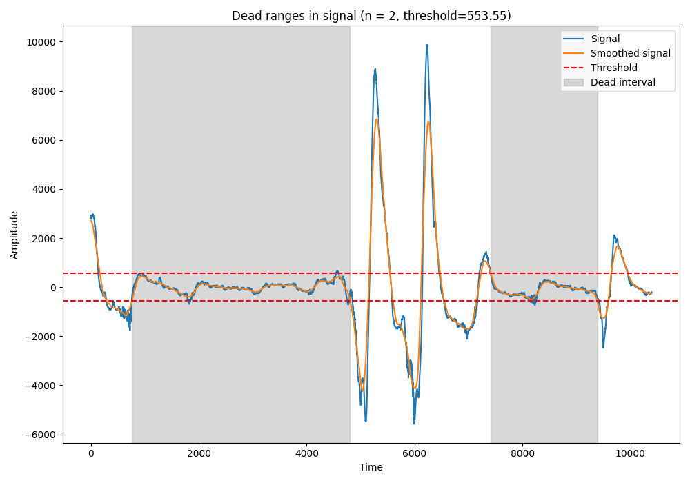

# respiratoryEvents

Respiratory Events dataset and images in Biosignals 2025 Congress.



## Data and script

Install the requirements:

```sh
pip install -r requirements.in
```

Run the code:

```sh
python signals.py
```
This reads the data from `events20mb.txt` and generates the signal charts with the detected dead zones.